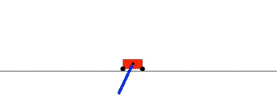
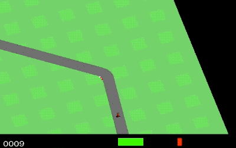

# prettyNEAT
 
 


Neuroevolution of Augmenting Topologies (NEAT) algorithm in numpy, built for multicore use and OpenAI's gym interface.

Original paper by Ken Stanley and Risto Miikkulainen: [Evolving Neural Networks Through Augmenting Topologies](http://citeseerx.ist.psu.edu/viewdoc/download?doi=10.1.1.28.5457&rep=rep1&type=pdf)

## Dependencies

Core algorithm tested with:

- Python 3.5.3

- NumPy 1.15.2 (`pip install numpy`)

- mpi4py 3.0.1 (`pip install mpi4py`)

- OpenAI Gym 0.9.6 (`pip install gym` -- installation details [here](https://github.com/openai/gym))


Domains tested with:

- Cart-pole Swing-up (included, but requires OpenAI gym)

- Bipedal Walker: Box2d (see OpenAI gym installation)

- Quadruped (Ant) Walker: PyBullet 1.6.3 (`pip install pybullet`)

- MNIST: Mnist utilities 0.2.2 (`pip install mnist`)

- VAE Racer: 
    - Tensorflow 1.8 (`pip install tensorflow==1.8.0`)
    - Pretrained VAE (in [wannRelease](../) -- copy to root to use, e.g: `cp -r ../vae .`)


To tune weights of produced network topologies

- CMA-ES: cma 2.6.0 (`pip install cma`)


## Training and Viewing Results

 


The 'cartpole_swingup' task doesn't have any dependencies and is set as the default task, try it with the default parameters:

Training command:
```
python neat_train.py
```

To view the performance of a trained controller (default `log/test_best.out` loaded):

```
python neat_test.py
```

To load and test a specific network:
```
python neat_test.py -i demo/swingup/test_best.out
```


## Using prettyNEAT

Check out the `prettyNeat_demo.ipynb` notebook for example usage.

prettyNeat uses an ask/tell pattern to handle parallelization:

```
  neat = Neat(hyp)  # Initialize Neat with hyperparameters
  for gen in range(hyp['maxGen']):        
    pop = neat.ask()            # Get newly evolved individuals from NEAT  
    reward = batchMpiEval(pop)  # Send population to workers to evaluate
    neat.tell(reward)           # Send fitness values back to NEAT    
```

The number of workers can be specified when called from the command line:

```
python neat_train.py -n 8
```


Algorithm hyperparameters are stored in a .json file. Default parameters specified with `-d`, modification with a `-p`:

```
python neat_train.py -d p/neat_default.json
```

or to use default except for certain changes

```
python neat_train.py -p p/swingup.json       # Swing up with standard parameters
python neat_train.py -p p/swing_allAct.json  # Swing up but allow hidden nodes to have several activations
```
The full list of hyperparameters is explained in [hypkey.txt](p/hypkey.txt)

Individuals are saved as 2D numpy arrays and after training can be retested and viewed with neat_view:

```
python neat_test.py -i log/test_best.out --view True
```


## Data Gathering and Visualization

Data about each run is stored by default in the `log` folder with the `test` prefix, though a new prefix can be specified:

```
python neat_train.py -o myExperiment_
```
Output files will still be placed in the 'log' folder but prepended with the 'myExperiment_' prefix

In addition to the best performing individual, prettyNEAT regularly updates a `_stats.out` file with run statistics. These statistics are stored as comma seperated values, and some helper functions are shown to display these statistics as well as the topology of the evolved networks.

see `prettyNeat_demo.ipynb` notebook for example usage.

---
## Extensions and Differences from Canonical NEAT

I will tried to implement NEAT faithfully to the original paper, and the purpose of this code is a jumping off point for other experiments so I will try to leave it mostly pristine. A few key differences and common extensions have been included:

- Compatibility threshold update
    - The compatibility threshold is regularly updated to keep the number of species near a desired number. Though use of this update is widespread and mentioned on the [NEAT User's Page](https://www.cs.ucf.edu/~kstanley/neat.html), to my knowledge it has never been explicitly mentioned in a publication.

- Activation functions
    - Unless a specific activation function to be used by all hidden nodes is specified in the hyperparameters, when a new node is created it can chosen from a list of activation functions defined by the task. A probability of mutating the activation function is also defined. This allows the code to easily handle extensions for HyperNEAT and CPPN experiments.
    
- Rank-based Fitness
    - The canonical NEAT uses raw fitness values to determine the relative fitness of individuals and species. This can cause scaling problems, and can't handle negative fitness values. PrettyNEAT instead ranks the population and assigns each individual a real-valued fitness based on this ranking.

- Multiobjectivization
    - Many extensions of NEAT involve optimizing for additional objectives (age, number of connections, novelty, etc) and we include non-dominated sorting of the population by multiple objectives. The probability that these alternate objectives are applied can also be tuned (e.g. normal optimization, but 20% chance of ranking based on fitness _and_ number of connections). This can be used with or without speciation.
    
- Weight Tuning with CMA-ES
    - Networks produced by PrettyNEAT are exported in the form of weight matrices and a vector of activation functions. We provide an interface to further tune the weights of these networks with CMA-ES: 
    
    ```
    python cmaes.py -i log/test_best.out
    ```

--- 
## Forks using prettyNEAT
- [Weight Agnostic Neural Networks (WANN)](../prettyNEAT_WANN)

<!---
- Additional extensions are kept as separate forks and can seen here:
    - [PicBreeder](link)
    - [HyperNEAT](link)
    - [CPPN-MapElites](link)
    - [AutoGrad for NEAT](link)
    - [Surrogate-Assisted NEAT](link)
--->
-----------

On Windows, it is easiest to install mpi4py as follows:

- Download and install mpi_x64.Msi from the HPC Pack 2012 MS-MPI Redistributable Package
- Install a recent Visual Studio version with C++ compiler
- Open a command prompt
```
git clone https://github.com/mpi4py/mpi4py
cd mpi4py
python setup.py install
```
Modify the train.py script and replace mpirun with mpiexec and -np with -n


---

### Citation
For attribution in academic contexts, please cite this work as

```
@article{wann2019,
  author = {Adam Gaier and David Ha},  
  title  = {Weight Agnostic Neural Networks},  
  eprint = {arXiv:1906.04358},  
  url    = {https://weightagnostic.github.io},  
  note   = "\url{https://weightagnostic.github.io}",  
  year   = {2019}  
}
```

## Disclaimer

This is not an official Google product.
